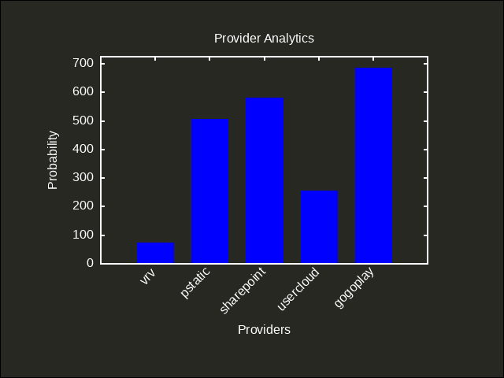

# ani-cli-status
Provides the ani-cli script status..

# description
This script scrapes from allanime homepage by fetching the random anime and then extracting the links from it..

#### Selected Episode details

Episode Name: Tsuki ga Michibiku Isekai Douchuu Season 2 Episode 3

Episode Link: https://allanime.to/bangumi/wAMnpBBwaE3fJ8jwH
# Analytics

# Providers

| Provider         | Resolution | Status                                             |
|------------------|------------|----------------------------------------------------|
| Wixmp            | Multi      |         |
| Dropbox          | Single     |       |
| SharePoint       | Single     |  |
| WeTransfer       | Single     |  |
| GoGo Direct      | Multi      |    |
